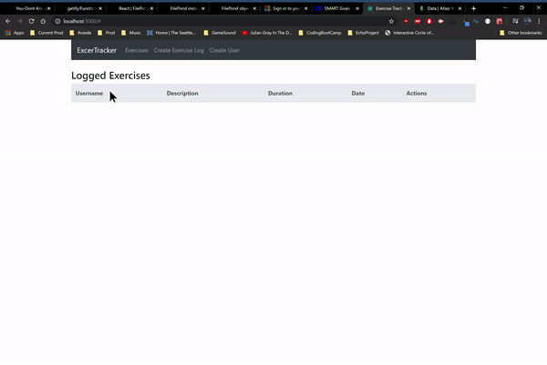

# Exercise Tracker
This app was built following the [freeCodeCamp MERN stack tutorial](https://www.youtube.com/watch?v=7CqJlxBYj-M)

### Technologies Used
#### Back-end
* Express
* Express/Express-Session
* MongoDB Atlas 
* Mongoose 
* cors
* dotenv

#### Front-End
* React
* react-router-dom
* Bootstrap 4
* axios 

## Current Issues
* None 

### Snapshots

